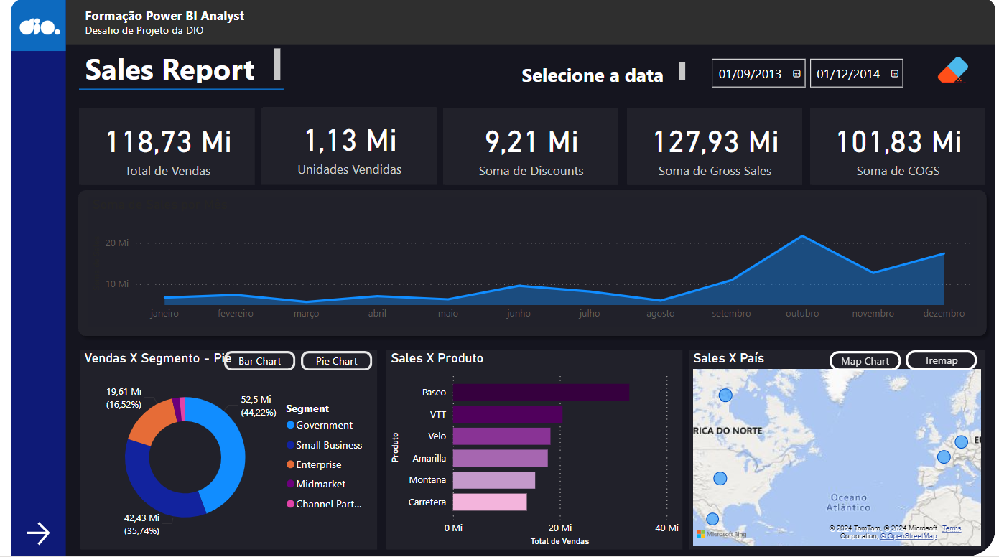
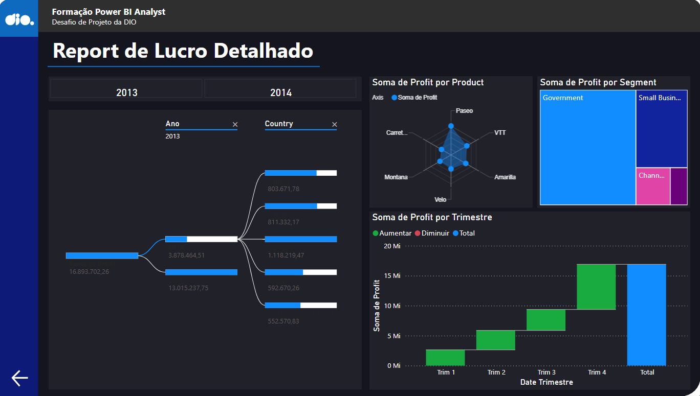

# PowerBI Sales Report

A comprehensive Sales Report created using Power BI as a challenge for [Digital Innovation One (DIO)](https://web.dio.me/), showcasing key sales metrics and visualizations.

## Table of Contents

- [Introduction](#introduction)
- [Features](#features)
- [Installation](#installation)
- [Usage](#usage)
- [Screenshots](#screenshots)
- [Contributing](#contributing)
- [License](#license)

## Introduction

This project features a Power BI report designed to provide insightful visualizations of sales data. The report includes various metrics such as total sales, sales by region, product performance, and more. This report was created as part of a challenge for [Digital Innovation One (DIO)](https://web.dio.me/).

## Features

- Interactive visualizations
- Key sales metrics
- Sales performance by region
- Product-wise sales analysis
- Time-series analysis of sales data
- Dynamic segmentation buttons
- Interactive navigation between pages

## Installation

To view and interact with this report, follow these steps:

1. Clone this repository to your local machine.
    ```bash
    git clone https://github.com/VicLira/powerbi-sales-report.git
    ```
2. Open the `.pbix` file in Power BI Desktop or access the report online via the link below.

## Usage

Open the `.pbix` file in Power BI Desktop to explore the various sales metrics and visualizations. You can interact with the report by filtering data, drilling down into specific metrics, and customizing the visualizations to meet your needs.

Alternatively, you can access the report online through the following link:

[Power BI Sales Report](https://app.powerbi.com/groups/me/reports/2624dc92-83f0-443b-ae59-0feb0d316de3?ctid=fd50b457-84e0-400c-80f2-460f28eb41a6&pbi_source=linkShare)

## Screenshots

Here are some screenshots of the report:


*Sales Overview*


*Regional Sales Analysis*

## Report Details

### First Page

- **Total Sales**
- **Sales by Unit**
- **Sum of Discounts**
- **Sum of Gross Sales**
- **Sum of COGS**: Cost of Goods Sold (COGS) represents the direct costs attributable to the production of the goods sold in a company.
- **Sales Over the Year**
- **Sales by Segment** (Bar and Pie charts)
- **Sales by Product**
- **Sales by Region** (Map and Treemap)

### Second Page - Detailed Profits

- **Sum of Profit by Segment**
- **Sum of Profit by Quarter**

In addition to these visualizations, the report includes dynamic segmentation buttons and interactive navigation between pages, allowing for a more detailed and user-friendly analysis experience.

## Contributing

If you would like to contribute to this project, please fork the repository and submit a pull request. For major changes, please open an issue first to discuss what you would like to change.

## License

This project is licensed under the MIT License. See the [LICENSE](LICENSE) file for details.
